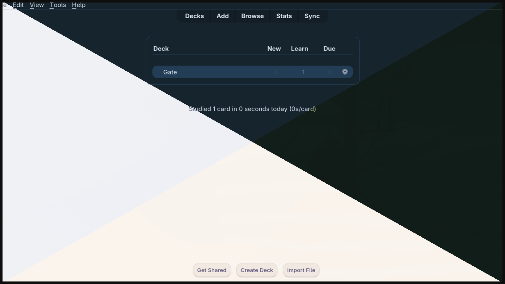
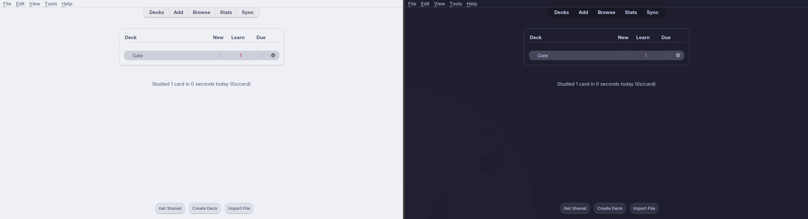
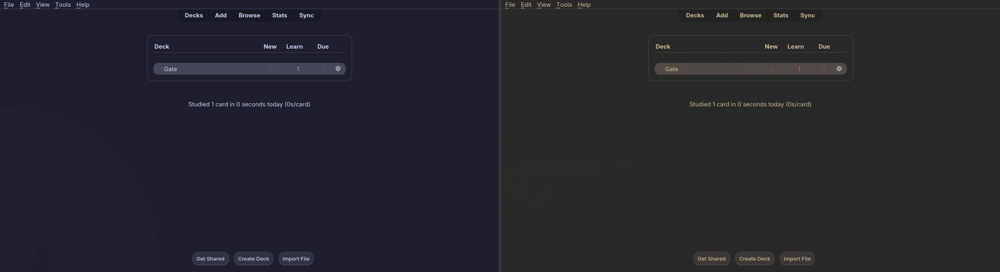

# Anki Theme for Omarchy

Anki, decked out in whatever Omarchy theme is active — live, full surface, no restart.

<!-- flip-time: re-shoot both screenshot pairs with the shipped plugin, drop
     preview.png at the repo root, and uncomment every flip-time: block in this
     file (wayfinder ticket 10, decision 5) — see the flip checklist on the ticket.

-->

Every Omarchy theme switch — from the menu, the CLI, or a theme scheduler — recolors
all of Anki: deck browser, reviewer, editor, stats, dialogs, menus, tables. Switch
from Catppuccin Latte to Gruvbox and a running Anki follows along instantly.

## What you get

- **Live switching.** No restart; the recolor typically lands before the theme
  command even returns.
- **Same-polarity switches are first-class.** Dark→dark palette changes (e.g.
  Catppuccin → Gruvbox) are invisible to Anki's native theme handling — they work
  here like any other switch.
- **Every theme works.** All 22 stock Omarchy themes and user-made themes alike:
  the palette is rendered from Omarchy's own `colors.toml`, so there is no
  per-theme configuration.
- **Legibility guard.** Palettes that would drop text below its WCAG-derived
  contrast floor on key surfaces are nudged back toward readable before mapping.
  Prefer the palette exactly as authored? Set `contrast_clamp = false`
  (faithful mode).
- **No network, no third-party dependencies.** Stdlib-only Python inside Anki,
  QML/JS in the shell. MIT licensed.

<!-- flip-time: re-shot screenshots land here — uncomment this whole block
     (heading included) once the images exist. The polarity-flip pair doubles
     as the marketplace preview.png (wayfinder ticket 10, decision 5).
## Screenshots



-->

## How it works

Two halves, one feature:

```
omarchy theme set (any trigger: menu, CLI, scheduler)
        │
        └─▶ rewrites ~/.local/state/omarchy/current/theme/
                    │
                    └─▶ Anki add-on (Python, in-process)
                            watches that directory, reads colors.toml,
                            maps its palette onto Anki's color variables,
                            re-applies through Anki's own theme pipeline
                            — in ~13–15 ms, live
```

The Omarchy plugin (Quickshell `service`) is the delivery half: with your consent
it installs the bundled add-on into Anki.

## Requirements

- Omarchy. <!-- ticket-13: replace with the exact declared minimum version before publishing -->
- Anki 26.08 or newer (Qt6), with its profile directory at the default
  `~/.local/share/Anki2` (true for native installs such as the Arch package).

## Install

```bash
omarchy plugin add https://github.com/Expri-commits/omarchy-anki-theme
```

On first run the plugin asks for consent before copying its bundled Anki add-on
into Anki's add-on folder — nothing touches your Anki configuration before you
say yes. Start Anki and it follows your theme.

## Remove

Two halves, two steps:

1. Remove the plugin: `omarchy plugin remove io.github.expri-commits.anki-theme`
2. Remove the add-on from Anki: **Tools → Add-ons → Anki Theme for Omarchy → Delete**

Anki immediately returns to its own theming.

## Configuration

Open **Tools → Add-ons → Anki Theme for Omarchy → Config** in Anki:

| Key | Default | Meaning |
| --- | --- | --- |
| `contrast_clamp` | `true` | Clamp palette colors that would fall below their WCAG-derived contrast floor on core surfaces. Set `false` for faithful mode — colors exactly as the theme authors them. |

## Privacy

No network access, no telemetry. The add-on reads Omarchy's theme files and runs
inside Anki; it writes only its own configuration. The plugin asks before placing
anything in your Anki profile.

## Development

Repo: `Expri-commits/omarchy-anki-theme`. The project was charted and decided on a
[wayfinder map](.scratch/anki-theme/map.md) — the map, its tickets, and the
[research](.scratch/anki-theme/research/) notes are the full decision log.
Performance measurements live in [`docs/performance.md`](docs/performance.md);
architecture decisions in [`docs/adr/`](docs/adr/).

- **Plugin** — Quickshell `service` (`Service.qml`), kept thin on purpose: payload
  install and theme watching only.
- **Add-on** — Python against Anki's own theme machinery: `tomllib`,
  `QFileSystemWatcher`, stdlib only. GUI-free logic is separated so pytest covers
  the mapping and clamp rules (`tests/`).
- **Tooling** — biome (JSON/JS), ruff (Python), qmllint/qmlformat (QML); tests run
  on the system python (the Anki runtime).

Prior art that shaped this project: [seara](https://github.com/rodrada/seara)
(in-Anki live-apply pattern), [ReColor](https://github.com/AnKing-VIP/AnkiRecolor)
(variable names only — it is AGPL, no code was used),
[catppuccin/anki](https://github.com/catppuccin/anki) (MIT palette-mapping
reference data).

## License

[MIT](LICENSE) — plugin, add-on, and docs.
